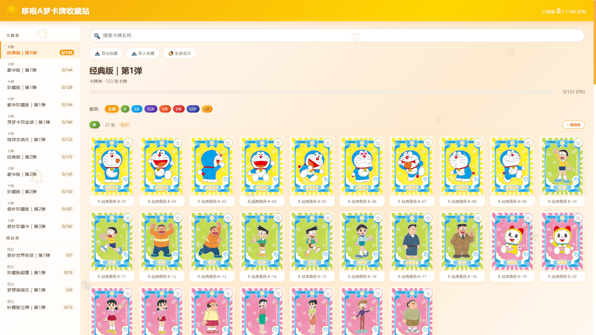
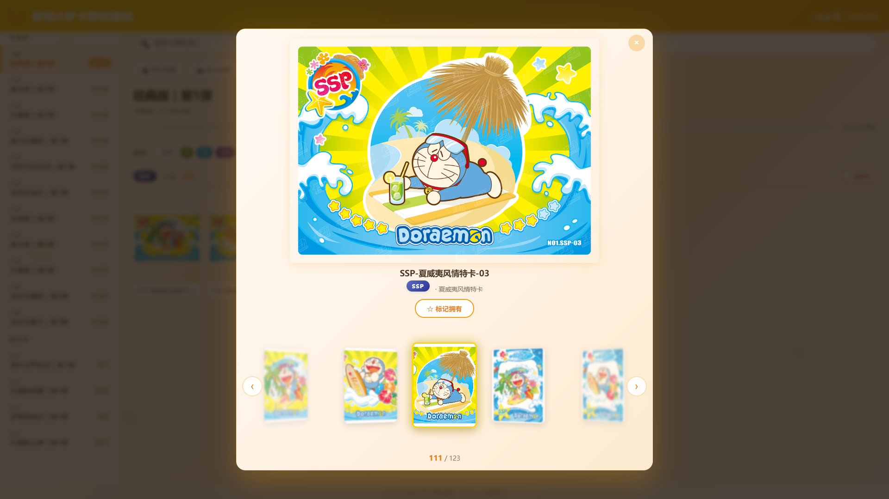

# doraemon-card-collection

基于纯前端（原生 HTML/CSS/JS，零构建）的哆啦A梦正版卡牌收藏管理网站，支持真 3D Coverflow 圆环预览、卡包/级别分层浏览、收藏进度与本地持久化。

## 🖼️项目预览





## 为什么需要？

- 哆啦A梦卡牌散落在大量图鉴文件夹中，难一眼览尽已收集情况
- 想以"翻卡"的仪式感浏览卡片，普通相册式列表缺乏沉浸感
- 收藏进度靠记忆，无法量化"还差哪些"

**doraemon-card-collection 解决这些问题**：一个零依赖、可离线打开的本地收藏站，把图鉴目录变成可检索、可标记的收藏册。

## ⭐亮点

- **真 3D Coverflow**：基于 CSS `perspective + rotateY + translateZ` 的弧形圆环预览，卡牌沿弧排列、左右渐退消失
- **流畅拖拽**：鼠标/触摸横向拖拽，浮点 `virtualIndex` 连续更新，松手平滑吸附
- **暖色调主题**：铃铛金配色 + 铃铛摆动 / 卡牌入场 / 进度流光等多处动画
- **分层浏览**：15 个卡包（卡牌类 + 周边类），卡牌按 30 级级别从低到高分组
- **收藏管理**：一键标记拥有、localStorage 持久化、导入导出 JSON 备份
- **检索筛选**：实时搜索 + 只看未拥有，快速定位缺口
- **智能去重标记**：同一卡面在不同卡包中复用时，标记一张自动同步标记所有同图卡牌；基于文件名 + wHash 感知哈希双重验证，精确区分同名但不同设计的卡牌
- **进度可视化**：总进度 + 卡包进度条 + 级别进度
- **零依赖离线**：纯前端无构建，`file://` 直接打开，数据内联规避 CORS

## 🚀快速开始

### 1. 克隆项目

```bash
# Gitee 镜像（国内访问快）
git clone https://gitee.com/yhl5244/doraemon-card-collection.git

# GitHub 原仓库
git clone https://github.com/5244DragonLin/doraemon-card-collection.git

cd doraemon-card-collection
```

### 2. 安装依赖

Python 脚本依赖：

```bash
pip install -r requirements.txt
```

### 3. 准备数据

卡牌图片数据来自上游采集工具 [kadong_cards_crawler](https://gitee.com/yhl5244/kadong_cards_crawler)（见「关联项目」）：它把哆啦A梦正版图鉴整理到本地目录，本项目的 `generate_data.py` 再扫描该目录生成 `data.js`。如需用自己重新采集的图鉴生成，先把它克隆下来，再按「⌨️CLI 模式」运行脚本（通过 `config.yaml` 指定 `source_dir`）。

### 4. 打开网站

直接双击 `index.html`，浏览器以 `file://` 协议打开，无需 HTTP 服务器。

> 数据已内联为 `data.js`（`var DORAEMON_DATA = {...};`），通过 `<script>` 标签加载，绕过了 `file://` 下的 `fetch` CORS 限制。

## ⌨️CLI 模式

卡牌数据来自上游采集工具 [kadong_cards_crawler](https://gitee.com/yhl5244/kadong_cards_crawler)（见「关联项目」）：它会把哆啦A梦正版图鉴整理到本地目录，本脚本再扫描该目录生成 `data.js`。脚本读取同目录 `config.yaml`（可选）配置，无额外命令行参数：

```bash
python generate_data.py
```

脚本行为：

- `config.yaml` 的 `paths.source_dir` 指向 kadong_cards_crawler 输出的图鉴目录；缺省时使用脚本内置默认值
- 扫描各卡包子目录，同时识别 `.png` / `.jpg` / `.jpeg`
- **三级正则解析**识别卡牌级别：纯 ASCII（`R`/`SSR`…）→ 中文+ASCII 混合（`特殊SSP`…）→ 纯中文（`金属卡`/`单人款`…），0 张未知级别
- 卡牌 ID 取 `md5(packFullName + "/" + cardName)` 前 16 位，源目录移动不影响收藏数据
- 输出 `data.js`（`var DORAEMON_DATA = {...};`，非纯 JSON）

### 去重标记数据生成

```bash
python generate_duplicate_groups.py
```

数据流：`generate_duplicate_groups.py` 读取 `data.js` 中的卡牌数据 → 按文件名分组 → 对每组内图片计算 wHash 感知哈希 → 聚类同名且同图的卡牌 → 输出 `duplicate_groups.js`。前端加载后，标记一张卡牌时自动同步标记同组所有卡牌。

> 依赖 `imagehash` 和 `Pillow`：`pip install imagehash Pillow`

## 配置文件

数据生成脚本 `generate_data.py` 会自动读取同目录下的 `config.yaml`（若存在）。`config.example.yaml` 是其字段模板，复制为 `config.yaml` 后按需修改即可：

```bash
cp config.example.yaml config.yaml
```

`paths.source_dir` 应指向 kadong_cards_crawler 输出的图鉴目录（见「关联项目」）；其余字段用于自定义扫描与排序规则。

```yaml
# config.example.yaml
paths:
  source_dir: "E:/BaiduSyncdisk/其他/卡动文创图鉴/哆啦A梦"  # ← kadong_cards_crawler 的输出目录
  output_file: "data.js"
scan:
  image_extensions: [".png", ".jpg", ".jpeg"]
pack_order: [ ... ]      # 卡包自定义排序（15 项）
rarity_order: [ ... ]    # 级别排序（从低到高，30 项）
```

> 若未提供 `config.yaml`，脚本回退到内置默认值；读取配置文件需要 PyYAML（`pip install pyyaml`）。

## 项目结构

```text
doraemon-card-collection/
├── index.html          # 主页面（HTML 骨架，引用外部 CSS/JS）
├── favicons/           # 站点图标（7 个尺寸）
├── style.css           # 全部样式（暖色调 + 3D圆环 + 动画 + 响应式）
├── config.js           # 前端常量配置
├── app.js              # 核心交互（数据加载/卡包/收藏/搜索/进度/导入导出）
├── carousel.js         # 3D 圆环模块（Coverflow 渲染/拖拽/吸附/键盘）
├── data.js             # 数据文件（var DORAEMON_DATA = {...}; 脚本生成）
├── generate_data.py    # 数据生成脚本（三级正则 + 扫 png/jpg + 输出 data.js）
├── generate_duplicate_groups.py  # 去重组生成脚本（文件名+wHash聚类 → duplicate_groups.js）
├── config.example.yaml # 数据脚本配置参考模板
├── requirements.txt    # Python 脚本依赖（PyYAML / Pillow / imagehash / numpy / scipy）
├── duplicate_groups.js # 去重组映射数据（脚本生成，供前端去重标记使用）
├── docs/               # ARCHITECTURE.md / PRD.md / 图示
├── tests/              # verify_data.py 数据校验
├── README.md
└── LICENSE
```

Script 加载顺序：

```html
<script src="data.js"></script>     <!-- 1. 数据 → DORAEMON_DATA -->
<script src="config.js"></script>   <!-- 2. 配置 → AppConfig -->
<script src="app.js"></script>      <!-- 3. 核心逻辑 → App + CollectionStore -->
<script src="carousel.js"></script> <!-- 4. 圆环模块 → CoverflowCarousel -->
```

## 配置说明

| 配置项（config.yaml 字段） | 说明 | 默认值 |
|------|------|--------|
| `paths.source_dir` | 卡牌图片源目录（含各卡包子目录）；应指向 kadong_cards_crawler 的输出目录 | `E:/BaiduSyncdisk/其他/卡动文创图鉴/哆啦A梦` |
| `paths.output_file` | `data.js` 输出路径（相对脚本目录或绝对路径） | 脚本同目录 `data.js` |
| `scan.image_extensions` | 扫描的图片扩展名 | `.png`, `.jpg`, `.jpeg` |
| `pack_order` | 卡包自定义排序（15 项） | 内置卡牌 / 周边顺序 |
| `rarity_order` | 级别排序表（从低到高，30 项） | `R` ~ `金属卡` |

## ❓️FAQ

**需要安装 Node / npm 吗？**

不需要。项目是纯前端零依赖，直接双击 `index.html` 即可，无需任何构建或本地服务器。

**为什么卡牌图片显示不出来？**

图片来自 kadong_cards_crawler 整理到本地的图鉴目录，由 `generate_data.py` 以 `file:///` 加载。请确保 `config.yaml` 中 `paths.source_dir`（或脚本内置默认值）指向的图鉴目录保持原位；若移动或重新采集，重新运行脚本生成 `data.js` 即可（卡牌 ID 基于名称，收藏数据不丢失）。

**收藏数据存在哪里？会丢失吗？**

收藏标记保存在浏览器 localStorage，随浏览器 / 设备隔离。建议用"导出收藏"生成 JSON 备份，换设备时"导入收藏"恢复。

**卡牌数据从哪里来？**

卡牌图片由上游采集工具 [kadong_cards_crawler](https://gitee.com/yhl5244/kadong_cards_crawler)（[GitHub](https://github.com/5244DragonLin/kadong_cards_crawler) 镜像）把哆啦A梦正版图鉴整理到本地目录；本项目的 `generate_data.py` 再扫描该目录生成 `data.js`。详见「关联项目」。

**可以自定义卡包顺序或级别顺序吗？**

可以。在 `config.yaml` 中配置 `pack_order` 与 `rarity_order`（见「配置文件」），或编辑脚本内置默认值后重新运行脚本。

## 📝已知问题 / 待改进点

- [x] 不同卡包的同级别卡牌有可能完全一致，暂不支持同样卡牌的一键标记（v0.3 已通过智能去重标记解决）
- [x] 首页卡牌预览图片虚线 / 模糊已修复：删除 `image-rendering: crisp-edges` 硬边放大，并将 `object-fit: cover` 改为 `contain`（卡牌完整显示、边缘平滑）
- [ ] 加入除正版授权外的哆啦A梦卡牌：扩展数据来源，支持非官方授权卡牌的收录与展示

## 🤝贡献

欢迎提 Issue 和 PR！

1. Fork 本仓库
2. 创建分支 `git checkout -b feature/your-feature`
3. 提交改动 `git commit -m "feat: ..."`
4. 推送并发起 Pull Request

## 📋更新日志

### v0.3

- **新增：** 智能去重标记：新增 `generate_duplicate_groups.py`（去重组生成脚本）与 `duplicate_groups.js`（去重组映射数据），基于文件名 + wHash 感知哈希双重验证，精确识别同一卡面在不同卡包中的复用。前端标记一张卡牌时自动同步标记同组所有卡牌，区分同名但不同设计的情况
- **新增：** 去重数据流：`generate_duplicate_groups.py` 读取 `data.js` → 按文件名分组 → wHash 聚类 → 输出 `duplicate_groups.js`
- **新增：** 一键返回顶部按钮：右下角新增浮动圆形"返回顶部"按钮（↑），滚动超过 300px 时淡入显示，点击平滑滚动到页面顶部。铃铛金渐变圆形设计，与暖色主题统一
- **新增：** 过滤按钮三合一拆分：将原"全部显示"按钮拆分为三个独立互斥按钮——「全部显示」（金色高亮）、「只看已拥有」（绿色高亮）、「只看未拥有」（红色高亮），点击切换时自动刷新卡牌视图，状态跨卡包保留

### v0.2

- **新增：** MIT 许可证（`LICENSE`），补齐开源合规
- **新增：** 启用配置文件：`generate_data.py` 自动读取同目录 `config.yaml`（缺省回退内置默认值，缺 PyYAML 自动降级）；数据来源 / 扫描 / 排序均可配置
- **新增：** 「关联项目」章节：说明卡牌数据来自上游采集工具 [kadong_cards_crawler](https://gitee.com/yhl5244/kadong_cards_crawler)（GitHub 镜像同步），并在快速开始 / CLI / FAQ 等处补充数据源说明
- **优化：** 站点图标整理：7 个 favicon 收拢至 `favicons/` 目录，根目录结构更清爽，`index.html` 引用同步更新
- **修复：** 侧边栏底部空隙：`.sidebar` 高度由 `calc(100vh - 128px)` 修正为 `calc(100vh - 80px)`，左侧与页面底部齐平（移动端隐藏逻辑不变）
- **修复：** 首页预览图虚线 / 模糊：删除 `image-rendering: crisp-edges` 硬边放大，`object-fit: cover` 改为 `contain`，卡牌完整显示、边缘平滑

### v0.1

- 初版卡牌收藏站：卡包 / 级别分层浏览、收藏标记、进度展示、搜索筛选

## 🔗关联项目

本项目自身只做展示与收藏管理，卡牌数据来自上游采集工具：

- **[kadong_cards_crawler](https://github.com/5244DragonLin/kadong_cards_crawler)** — 哆啦A梦（卡动文创）正版卡牌图鉴爬取/整理工具，本项目的 `data.js` 数据源
  - GitHub：https://github.com/5244DragonLin/kadong_cards_crawler
  - Gitee：https://gitee.com/yhl5244/kadong_cards_crawler

> 使用前请先克隆并运行 kadong_cards_crawler 获取图鉴目录，再在 `config.yaml`（`config.example.yaml` 复制而来）中将 `paths.source_dir` 指向它的输出目录，最后运行 `python generate_data.py`。

## ☕捐赠

如果这个项目对你有帮助，可以请我喝杯咖啡~

| 支付宝 | 微信 |
|--------|------|
|  |  |

## ⚠️免责声明

本项目为个人收藏与学习用途的辅助工具，所有哆啦A梦卡牌图片及 IP 版权归原作者及权利方所有。

项目不对图片做任何重新分发；数据由使用者本地的图鉴目录生成。因使用本工具产生的一切后果由使用者自行承担，作者不承担任何法律责任。

## 📃许可证

本项目基于 [MIT](LICENSE) 协议开源。
