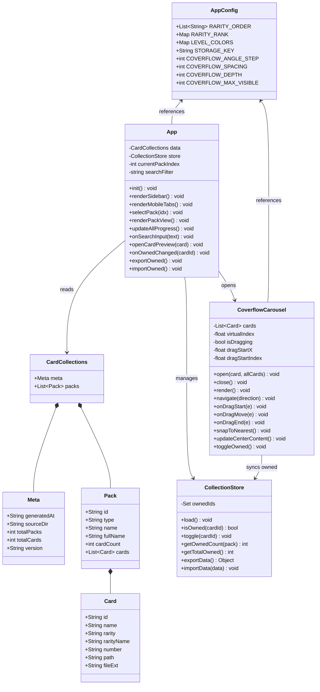
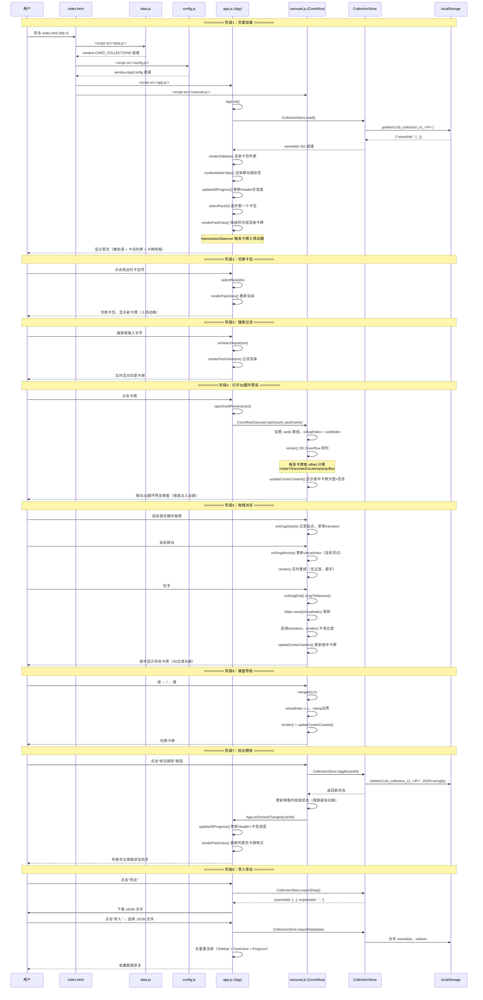
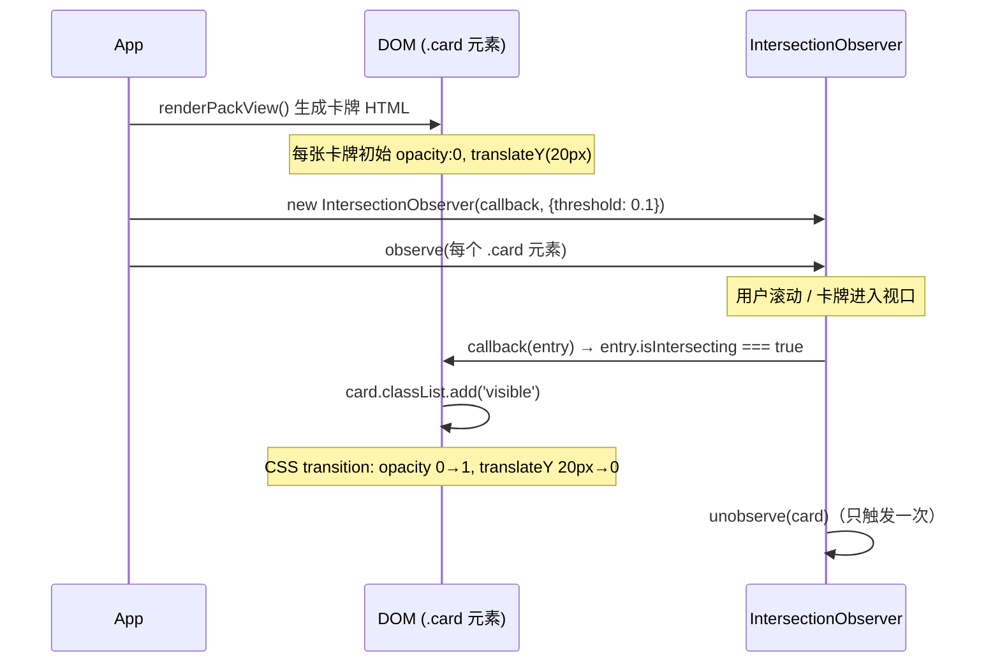
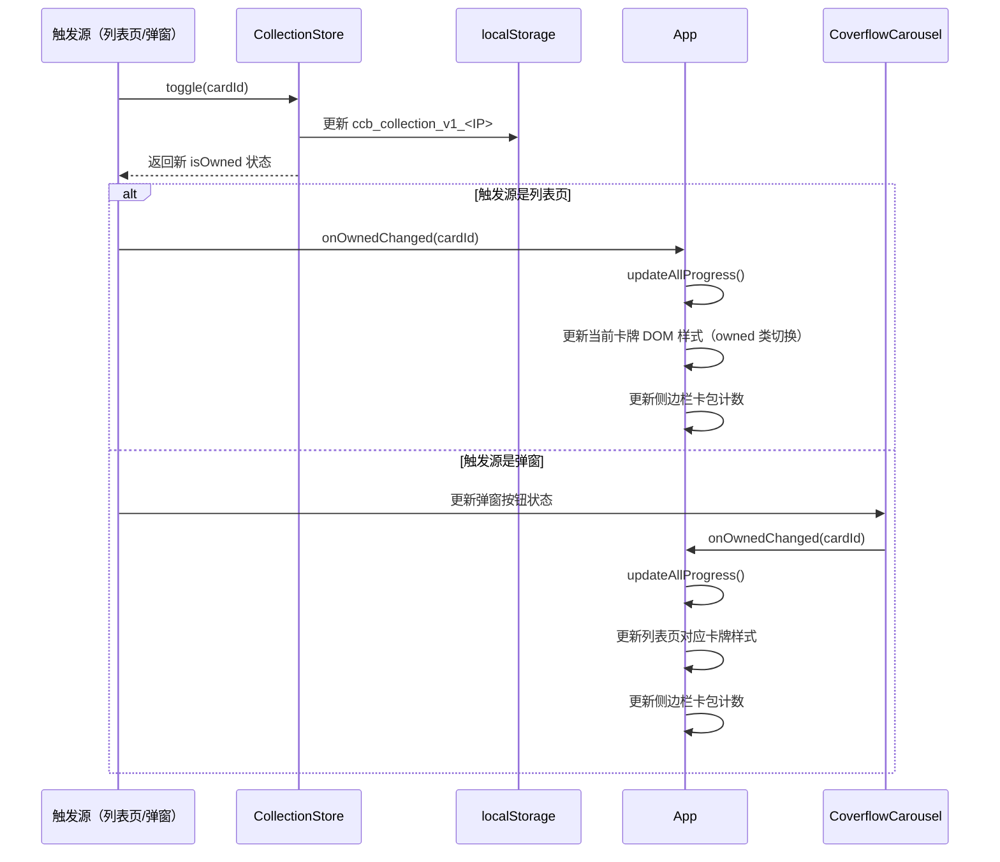
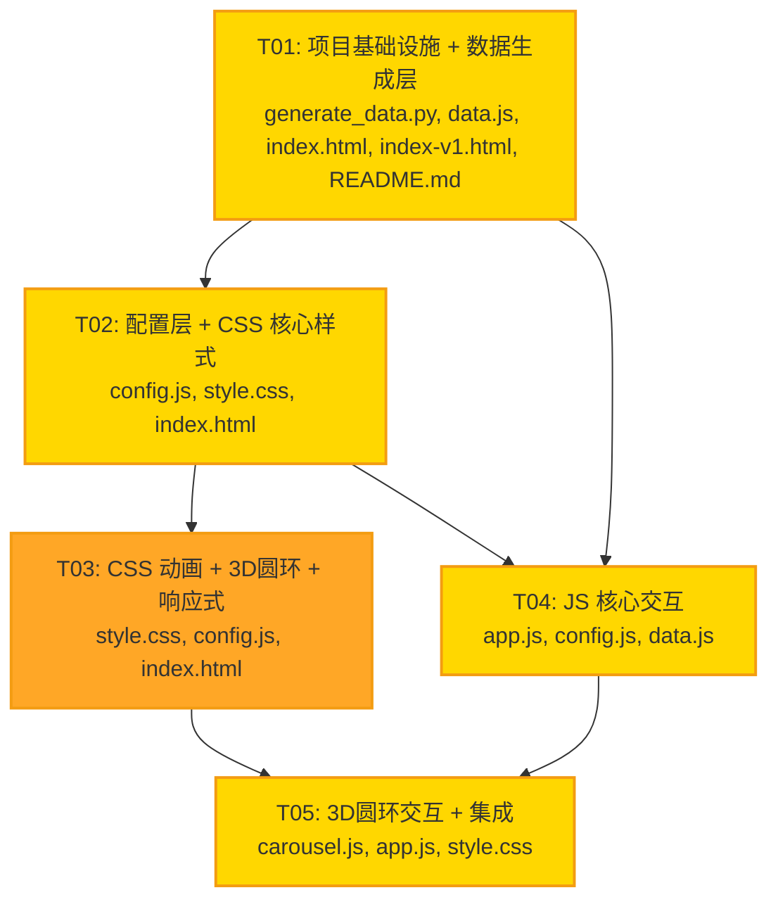

# 集卡册 — 系统架构设计 + 任务分解

> 架构师：高见远（Bob）  
> 项目：集卡册升级重做  
> 日期：2025-07  

---

## 目录

- [Part A: 系统设计](#part-a-系统设计)
  - [1. 实现方案 + 框架选型](#1-实现方案--框架选型)
  - [2. 文件列表及相对路径](#2-文件列表及相对路径)
  - [3. 数据结构](#3-数据结构)
  - [4. 程序调用流程](#4-程序调用流程)
  - [5. 待明确事项](#5-待明确事项)
- [Part B: 任务分解](#part-b-任务分解)
  - [6. 依赖包列表](#6-依赖包列表)
  - [7. 任务列表](#7-任务列表)
  - [8. 共享知识（跨文件约定）](#8-共享知识跨文件约定)
  - [9. 任务依赖图](#9-任务依赖图)

---

# Part A: 系统设计

## 1. 实现方案 + 框架选型

### 1.1 技术栈确认

**确认采用主理人建议的纯前端无构建方案**，理由如下：

| 决策点 | 选择 | 理由 |
|--------|------|------|
| 框架 | 无框架，原生 HTML/CSS/JS | 用户习惯双击 `index.html` 以 `file://` 打开，React/Vue 需构建步骤且 `file://` 下 ES Module 受限 |
| 数据加载 | `<script>` 标签内联 `data.js`（全局变量 `CARD_COLLECTIONS`） | `fetch()` 在 `file://` 协议下触发 CORS 限制，`<script>` 标签无此问题 |
| 图片加载 | `file:///` 绝对路径 | 用户图片在本地，通过绝对路径直接引用 |
| 3D 圆环 | 纯 CSS 3D（`perspective` + `rotateY` + `translateZ`） | 无需 Three.js 等重量级库，CSS 3D Transform 足以实现 Coverflow 效果，性能好（GPU 加速） |
| 动画 | CSS `transition` / `@keyframes` | 原生支持，GPU 加速，60fps 流畅 |
| 持久化 | `localStorage`（单 key JSON 对象） | 无需后端，本地持久化足够 |
| 构建 | 无构建步骤 | 直接编辑 → 刷新即可，降低使用门槛 |

### 1.2 核心技术挑战与解决方案

#### 挑战一：3D Coverflow 圆环预览

**难点**：需要真正的 3D 透视效果（非伪 3D），支持流畅拖拽 + 松手吸附。

**方案**：
- 容器设置 `perspective: 1200px`，创建 3D 空间
- 每张卡牌按距中心的偏移量计算 `rotateY`、`translateZ`、`scale`、`opacity`、`blur`
- 拖拽时使用浮点 `virtualIndex` 实时更新所有卡牌位置，松手后 `Math.round()` 吸附到最近卡牌
- 拖拽时禁用 `transition`（实时跟随），松手后启用 `transition`（平滑吸附）

**3D 变换公式**（`offset` 为卡牌相对中心的浮点偏移量）：

```
角度步进 ANGLE_STEP = 28（度）
水平间距 SPACING = 130（px）
纵深退后 DEPTH = 100（px）
最小缩放 MIN_SCALE = 0.4
最小透明度 MIN_OPACITY = 0.15
最大模糊 MAX_BLUR = 6（px）
最大可见偏移 MAX_VISIBLE = 4（每侧最多4张，共9张可见）

对偏移量为 offset 的卡牌：
  absOffset = |offset|
  
  rotateY = -offset * ANGLE_STEP          // 右侧卡牌向左倾斜，左侧卡牌向右倾斜
  translateX = offset * SPACING            // 水平排列
  translateZ = -absOffset * DEPTH          // 距中心越远越后退
  scale = max(MIN_SCALE, 1 - absOffset * 0.12)
  opacity = max(MIN_OPACITY, 1 - absOffset * 0.22)
  blur = min(MAX_BLUR, absOffset * 1.5)   // px
  zIndex = 100 - floor(absOffset)          // 中心最高
  
  若 absOffset > MAX_VISIBLE + 0.5 → display: none（不可见卡牌隐藏）

居中卡牌（offset ≈ 0）额外效果：
  - 金色高光边框 border: 3px solid #FFD700
  - box-shadow 金色光晕
  - 无模糊、无缩小
```

**拖拽实现**：

```javascript
// 拖拽状态
let isDragging = false;
let dragStartX = 0;           // 鼠标按下时的 X 坐标
let dragStartIndex = 0;       // 拖拽开始时的虚拟索引
let virtualIndex = 0;         // 浮点虚拟索引（拖拽时连续变化）

// 鼠标按下
onDragStart(e):
  isDragging = true
  dragStartX = e.clientX
  dragStartIndex = virtualIndex
  禁用 track 的 transition（实时跟随）

// 鼠标移动
onDragMove(e):
  if (!isDragging) return
  deltaX = e.clientX - dragStartX
  // 像素→卡牌单位的换算：拖拽一个卡牌宽度 ≈ 移动 SPACING 像素
  cardDelta = deltaX / SPACING
  virtualIndex = dragStartIndex - cardDelta  // 向右拖→看上一张
  virtualIndex = clamp(virtualIndex, 0, total - 1)
  renderCoverflow()  // 实时重新渲染（无 transition）

// 鼠标松开
onDragEnd():
  isDragging = false
  snapIndex = Math.round(virtualIndex)
  snapIndex = clamp(snapIndex, 0, total - 1)
  virtualIndex = snapIndex
  启用 track 的 transition（平滑吸附）
  renderCoverflow()
  // 更新主图、信息、计数器
  updateModalContent()
```

#### 挑战二：数据生成脚本修复

**难点**：现有正则 `^([A-Za-z?]+)-(.+)$` 无法处理中文前缀（特殊SSP、隐藏款SSP、SSP银版、EX内页、EX封面、金属卡），且只扫描 `.png`。

**方案**：三级解析策略（详见 [8.4 generate_data.py 正则方案](#84-generate_datapy-正则方案)）

#### 挑战三：file:// 协议约束

**难点**：`fetch()` 在 `file://` 下被浏览器 CORS 策略阻止。

**方案**：数据内联为 `data.js`，通过 `<script>` 标签加载为全局变量 `CARD_COLLECTIONS`，无需 `fetch`。

### 1.3 架构模式

采用 **模块化过程式** 架构（非 MVC/MVVM，因为无框架）：

```
┌──────────────────────────────────────────────────┐
│                   index.html                      │
│  (HTML 结构 + <script> 加载 data.js/config.js/   │
│   app.js/carousel.js)                             │
├──────────┬──────────┬──────────┬─────────────────┤
│ data.js  │config.js │  app.js  │  carousel.js    │
│          │          │          │                 │
│ CARD     │ 常量配置  │ 核心交互  │ 3D圆环预览模块   │
│ COLLECT  │ 级别表    │ 数据加载  │ Coverflow渲染   │
│ (全局)   │ 颜色映射  │ 卡包浏览  │ 拖拽/触摸       │
│          │          │ 收藏/搜索 │ 吸附/键盘导航    │
│          │          │ 进度/导入 │ 拥有标记同步     │
│          │          │ 导出     │                 │
├──────────┴──────────┴──────────┴─────────────────┤
│                   style.css                       │
│  (暖色调主题 + 布局 + 3D圆环 + 动画 + 响应式)      │
├──────────────────────────────────────────────────┤
│                localStorage                       │
│  key: ccb_collection_v1_<IP>                     │
│  value: {"ownedIds": ["id1","id2",...]}          │
└──────────────────────────────────────────────────┘
```

**模块间通信**：通过全局函数调用 + DOM 事件。`app.js` 中的 `openModal()` 调用 `carousel.js` 中定义的 `CoverflowCarousel.open()`；`carousel.js` 中的 `toggleOwned()` 回调 `app.js` 中的 `onOwnedChanged()` 更新列表页。

---

## 2. 文件列表及相对路径

项目根目录：`card-collection-book/`

```
card-collection-book/
├── index.html              # 新版主页面（HTML 结构 + 引用外部 CSS/JS）
├── index-v1.html           # 旧版备份（从原 index.html 重命名）
├── style.css               # 全部样式（暖色调 + 3D圆环 + 动画 + 响应式）
├── config.js               # 常量配置（RARITY_ORDER / LEVEL_COLORS / 拖拽参数等）
├── app.js                  # 核心交互（数据加载/卡包/收藏/搜索/进度/导入导出）
├── carousel.js             # 3D 圆环预览模块（Coverflow渲染/拖拽/吸附/键盘）
├── data.js                 # 数据内联（var CARD_COLLECTIONS = {...};  由脚本生成）
├── generate_data.py        # 数据生成脚本（修复正则 + 扫 .png/.jpg + 输出 data.js）
├── README.md               # 项目说明（更新使用方法）
└── docs/
    ├── ARCHITECTURE.md     # 本架构设计文档
    ├── PRD.md              # 产品需求文档（产品经理产出）
    ├── sequence-diagram.mermaid   # 时序图
    └── class-diagram.mermaid      # 类图
```

**文件职责说明**：

| 文件 | 职责 | 行数估算 |
|------|------|----------|
| `index.html` | HTML 骨架结构，引用所有外部资源，无内联 CSS/JS | ~120 行 |
| `style.css` | 全部样式：CSS 变量、Reset、Header、Sidebar、Main Content、卡牌网格、级别徽章、进度条、3D 圆环、动画 @keyframes、响应式、背景动效 | ~900 行 |
| `config.js` | 常量定义：RARITY_ORDER、RARITY_RANK、LEVEL_COLORS、COVERFLOW 参数、STORAGE_KEY | ~120 行 |
| `app.js` | 核心逻辑：数据加载、状态管理、卡包列表渲染、级别分组、收藏标记、进度统计、搜索过滤、导入导出 | ~500 行 |
| `carousel.js` | 3D 圆环：Coverflow 渲染、鼠标/触摸拖拽、松手吸附、键盘导航、拥有标记同步 | ~350 行 |
| `data.js` | 数据文件（脚本生成），`var CARD_COLLECTIONS = {...};` | ~数万行（自动生成） |
| `generate_data.py` | 数据生成：扫描源目录、解析文件名、排序、输出 data.js | ~150 行 |

**`index.html` 中 `<script>` 加载顺序**（关键！依赖顺序）：

```html
<script src="data.js"></script>     <!-- 1. 先加载数据 → 全局变量 CARD_COLLECTIONS -->
<script src="config.js"></script>   <!-- 2. 加载配置 → 全局常量 RARITY_ORDER 等 -->
<script src="app.js"></script>      <!-- 3. 加载核心逻辑 → 定义 App 对象 -->
<script src="carousel.js"></script> <!-- 4. 加载圆环模块 → 定义 CoverflowCarousel 对象 -->
                                    <!--    app.js 末尾调用 App.init() 启动应用 -->
```

> **注意**：所有 JS 使用全局对象模式（`window.App = {...}`、`window.CoverflowCarousel = {...}`），不使用 ES Module（`import/export`），因为 `file://` 下 ES Module 受限。

---

## 3. 数据结构

### 3.1 CARD_COLLECTIONS JSON Schema

`data.js` 文件内容为 `var CARD_COLLECTIONS = { "<IP>": Collection, ... };`，**按 IP 分桶**，每个 IP 是一个独立的 `Collection` 对象（含 `meta` + `packs`）。结构如下：

```json
{
  "哆啦A梦": {
    "meta": {
      "generatedAt": "2025-07-05T21:40:00",
      "sourceDir": "E:/BaiduSyncdisk/其他/集卡册/哆啦A梦",
      "totalPacks": 15,
      "totalCards": 1708,
      "version": "2.0"
    },
    "packs": [
    {
      "id": "p00",
      "type": "卡牌",
      "name": "地球交响乐｜第1弹",
      "fullName": "卡牌｜地球交响乐｜第1弹",
      "cardCount": 50,
      "cards": [
        {
          "id": "a1b2c3d4e5f6a7b8",
          "name": "R-经典角色卡-01",
          "rarity": "R",
          "rarityName": "经典角色卡",
          "number": "01",
          "path": "E:/BaiduSyncdisk/其他/集卡册/哆啦A梦/卡牌｜地球交响乐｜第1弹/R-经典角色卡-01.png",
          "fileExt": ".png"
        }
      ]
    }
  ],
  "三国志8 REMAKE": { "meta": { ... }, "packs": [ ... ] },
  "CF穿越火线": { "meta": { ... }, "packs": [ ... ] }
}
```

> **去重组**：`duplicate_groups.js` 导出 `var DUPLICATE_GROUPS = { "<IP>": { "<cardId>": <groupIndex>, ... }, ... }`，用于跨卡包同名卡牌的"重复"聚合展示。

> **收藏持久化**：每个 IP 的收藏状态独立存储在 `localStorage`，key 为 `ccb_collection_v1_<IP>`。

### 3.2 字段定义

#### Meta 对象

| 字段 | 类型 | 说明 |
|------|------|------|
| `generatedAt` | string (ISO 8601) | 数据生成时间 |
| `sourceDir` | string | 源目录路径（正斜杠） |
| `totalPacks` | int | 卡包总数 |
| `totalCards` | int | 卡牌总数 |
| `version` | string | 数据版本号 |

#### Pack 对象

| 字段 | 类型 | 说明 |
|------|------|------|
| `id` | string | 卡包唯一标识（`p00` ~ `p14`，按排序顺序） |
| `type` | string | 卡包类型：`"卡牌"` 或 `"周边"` |
| `name` | string | 卡包简称（去掉类型前缀，如 `"地球交响乐｜第1弹"`） |
| `fullName` | string | 卡包全名（含类型前缀，如 `"卡牌｜地球交响乐｜第1弹"`） |
| `cardCount` | int | 卡牌数量 |
| `cards` | Card[] | 卡牌数组（按级别从低到高排序） |

#### Card 对象

| 字段 | 类型 | 说明 |
|------|------|------|
| `id` | string | 卡牌唯一标识（`md5(packFullName + "/" + cardName)` 前 16 位） |
| `name` | string | 卡牌显示名（文件名去扩展名，如 `"R-经典角色卡-01"`） |
| `rarity` | string | 级别代码（如 `"R"`、`"SSP"`、`"金属卡"`、`"单人款"`） |
| `rarityName` | string | 级别名称（如 `"经典角色卡"`） |
| `number` | string | 编号（如 `"01"`，无编号则为空字符串 `""`） |
| `path` | string | 图片绝对路径（正斜杠，如 `"D:/BaiduSyncdisk/.../R-经典角色卡-01.png"`） |
| `fileExt` | string | 文件扩展名（`".png"` 或 `".jpg"`） |

### 3.3 卡包 ID 生成规则

> **注意**：卡包 `id` 在每个 IP 内部独立从 `p00` 编号；不同 IP 之间 `id` 可能重复，需结合所属 IP 区分。

```python
# 每个 IP 内部：卡牌类在前（Unicode 卡 < 周），周边类在后
# p00 = 卡牌｜地球交响乐｜第1弹
# p01 = 卡牌｜奇妙珍藏卡｜第3弹
# ...
# p10 = 卡牌｜豪华珍藏版｜第1弹
# p11 = 周边｜奇妙世界色纸｜第1弹
# ...
# p14 = 周边｜珍藏版徽章｜第1弹
pack_id = f"p{index:02d}"
```

### 3.4 卡牌 ID 生成规则

```python
import hashlib
raw = f"{pack_full_name}/{card_name}"  # 如 "卡牌｜珍藏版｜第1弹/R-经典角色卡-01"
card_id = hashlib.md5(raw.encode('utf-8')).hexdigest()[:16]
# 如 "a1b2c3d4e5f6a7b8"
```

> **设计考量**：使用 `packFullName + cardName` 的哈希而非路径哈希，这样即使源目录移动（路径变化），只要卡包名和卡牌文件名不变，ID 保持稳定，收藏数据不会丢失。

### 3.5 类图



---

## 4. 程序调用流程

### 4.1 时序图



### 4.2 关键流程补充说明

#### 4.2.1 卡牌入场动画流程



#### 4.2.2 收藏状态同步流程



---

## 5. 待明确事项

### 5.1 已发现的数据问题（扫描确认）

| 编号 | 发现 | 影响 | 建议处理 |
|------|------|------|----------|
| Q-1 | 周边 类卡牌使用纯中文级别名（单人款、双人款、隐藏款、梦幻花边、流光云彩、趣味拼图、奇妙世界、梦想摇摇乐），不在 PRD 的 RARITY_ORDER 中 | 级别排序时这些中文名会获得高 rank 值，排在卡牌类级别之后 | **可接受**：周边类卡包内级别独立排序，不影响卡牌类。`generate_data.py` 对纯中文前缀直接用作级别，排序 rank 设为 9999+（按名称排序） |
| Q-2 | `隐藏款SSP金版-奇妙宇宙镂空卡` 存在（PRD 只提到 `隐藏款SSP`），是带"金版"后缀的变体 | 正则需正确提取 `SSP` | **已处理**：三级解析策略的"混合前缀提取 ASCII"步骤自动提取 `SSP`，忽略中文后缀 |
| Q-3 | `隐藏款-隐藏款-01.png` 存在于 `周边｜妙趣版立牌｜第1弹`，级别为纯中文 `隐藏款` | 需识别为有效级别 | **已处理**：纯中文前缀直接用作级别 |
| Q-4 | `EX-哆啦人像内嵌书卡（红闪版-外页）-01.png` 文件名中括号内含 `-` | 分割 `rarityName` 和 `number` 时需注意 | **已处理**：按最后一个 `-` 分割，若最后一部分为纯数字则为编号 |
| Q-5 | `EX封面-哆啦A梦勋章书卡-红版封面.png` 末尾不是数字编号 | `number` 字段为空 | **可接受**：`number` 为空字符串 |
| Q-6 | `梦想摇摇乐-冲浪.png` 只有两段（无编号） | `number` 为空，`rarityName` = `冲浪` | **可接受** |

### 5.2 架构假设

1. **图片路径稳定**：假设源目录 `E:\BaiduSyncdisk\其他\集卡册\哆啦A梦` 不会移动。若移动，需重新运行 `generate_data.py`。卡牌 ID 基于 `packFullName + cardName` 哈希，不依赖路径，所以收藏数据不受路径变化影响。
2. **浏览器兼容性**：假设用户使用现代浏览器（Chrome 90+ / Edge 90+ / Firefox 88+），支持 CSS 3D Transform、IntersectionObserver、CSS Custom Properties。
3. **localStorage 容量**：卡牌总量约 1000+，收藏 ID 列表占用空间极小（< 100KB），远低于 localStorage 5MB 限制。
4. **图片尺寸**：假设所有卡牌图片纵横比接近 3:4，CSS 使用 `aspect-ratio: 3/4` 统一显示。若有异常比例图片，`object-fit: cover` 裁切处理。

---

# Part B: 任务分解

## 6. 依赖包列表

### 6.1 前端（无 npm 依赖）

本项目为纯前端无构建项目，**零 npm 依赖**。所有功能通过原生 HTML/CSS/JS 实现。

### 6.2 Python 脚本（仅标准库）

```
- os        (标准库): 目录扫描、路径操作
- json      (标准库): JSON 序列化输出
- re        (标准库): 正则表达式解析文件名
- hashlib   (标准库): 生成卡牌 ID (MD5)
- datetime  (标准库): 生成 meta.generatedAt 时间戳
```

无需 `pip install` 任何第三方包。

---

## 7. 任务列表

### T01: 项目基础设施 + 数据生成层

| 项目 | 内容 |
|------|------|
| **Task ID** | T01 |
| **Task Name** | 项目基础设施 + 数据生成层 |
| **源文件** | `generate_data.py`（重写）、`data.js`（脚本生成）、`index-v1.html`（备份）、`index.html`（HTML 骨架）、`README.md`（更新） |
| **依赖** | 无 |
| **优先级** | P0 |

**详细说明**：

1. **`generate_data.py` 重写**：
   - 修复正则：采用三级解析策略（纯ASCII / 混合中文+ASCII提取 / 纯中文直接用），详见 [8.4 节](#84-generate_datapy-正则方案)
   - 扫描 `.png` **和** `.jpg`（`filename.lower().endswith(('.png', '.jpg', '.jpeg'))`）
   - 输出 `data.js`（`var CARD_COLLECTIONS = {...};` 格式），不再输出 `data.json`
   - 生成完整 Card 对象（id, name, rarity, rarityName, number, path, fileExt）
   - 生成 Meta 对象（generatedAt, sourceDir, totalPacks, totalCards, version）
   - 卡牌按级别排序（`RARITY_ORDER` rank），同级别按文件名排序
   - 路径使用正斜杠（`/`），适配 `file:///` 协议

2. **运行脚本生成 `data.js`**：
   - 执行 `python generate_data.py`
   - 验证输出包含 15 个卡包，扫描 `.png` + `.jpg`
   - 验证特殊前缀正确解析（特殊SSP→SSP、隐藏款SSP→SSP、SSP银版→SSP、EX内页→EX、EX封面→EX、金属卡→金属卡）

3. **`index-v1.html` 备份**：
   - 将现有 `index.html` 复制为 `index-v1.html`

4. **`index.html` 新建**（HTML 骨架，不含内联 CSS/JS）：
   - `<head>`：meta 标签、`<title>`、`<link rel="stylesheet" href="style.css">`
   - `<body>` 结构：
     - `<header class="header">`：铃铛 + 标题 + 总进度统计 `#headerStats`
     - `<div class="app-container">`：
       - `<nav class="sidebar" id="sidebar">`：卡包列表容器
       - `<div class="mobile-tabs" id="mobileTabs">`：移动端标签容器
       - `<main class="main-content" id="mainContent">`：
         - `<div class="search-bar">` + `<input id="searchInput">`
         - `<div class="toolbar">`：导出/导入按钮
         - `<div id="packView">`：卡牌视图容器
     - `<div class="modal-overlay" id="modalOverlay">`：3D 圆环预览弹窗
       - `<div class="modal-content">`：关闭按钮 + 主图区 + 信息区 + 3D圆环区 + 计数器
     - `<div class="footer">`
     - `<div class="bg-decoration">`：背景装饰元素（飘浮的哆啦A梦元素）
   - `<script>` 标签按顺序加载：`data.js` → `config.js` → `app.js` → `carousel.js`

5. **`README.md` 更新**：
   - 更新使用方法（双击 `index.html` 即可，无需 HTTP 服务器）
   - 更新项目结构
   - 说明 `generate_data.py` 重新生成数据的步骤

---

### T02: 配置层 + CSS 核心样式（暖色调 + 布局 + 组件）

| 项目 | 内容 |
|------|------|
| **Task ID** | T02 |
| **Task Name** | 配置层 + CSS 核心样式（暖色调 + 布局 + 组件） |
| **源文件** | `config.js`（新建）、`style.css`（新建-核心部分）、`index.html`（配合调整 HTML 结构细节） |
| **依赖** | T01 |
| **优先级** | P0 |

**详细说明**：

1. **`config.js` 新建**（全局常量定义）：
   - `RARITY_ORDER`：30 种级别排序表（29 个 ASCII 级别 + 金属卡），详见 [8.1 节](#81-rarity_order-级别排序表)
   - `RARITY_RANK`：`{level: rank}` 映射，`?` → -1，未知 → 99999
   - `LEVEL_COLORS`：每个级别的渐变色映射 `{level: {bg: "linear-gradient(...)", text: "#fff"}}`，详见 [8.2 节](#82-level_colors-级别颜色映射表)
   - `STORAGE_KEY`：`'ccb_collection_v1_<IP>'`
   - `COVERFLOW` 参数对象：`{ANGLE_STEP: 28, SPACING: 130, DEPTH: 100, MIN_SCALE: 0.4, MIN_OPACITY: 0.15, MAX_BLUR: 6, MAX_VISIBLE: 4}`
   - 全局暴露：`window.AppConfig = { RARITY_ORDER, RARITY_RANK, LEVEL_COLORS, STORAGE_KEY, COVERFLOW }`

2. **`style.css` 核心样式**：
   - **CSS 变量定义**（`:root`）：暖色调主题变量，详见 [8.3 节](#83-css-变量定义)
   - **Reset & Base**：`box-sizing`、字体、背景渐变（温暖米白→浅蜜橙→暖奶黄）
   - **Header**：暖色渐变背景（铃铛金→亮蓝）、铃铛动画、总进度统计
   - **Sidebar**：卡包列表、active 状态（金色左边框）、卡包计数
   - **Mobile Tabs**：横向滚动标签、active 状态
   - **Main Content**：搜索栏（圆角输入框，聚焦金色光晕）、工具栏按钮
   - **Pack Header**：卡包标题、元信息
   - **Progress Bar**：进度条（金色渐变填充 + 流光动画）
   - **Rarity Group**：级别分组标题、级别徽章（`[data-rarity="X"]` 渐变色）
   - **Card Grid**：响应式网格（`auto-fill, minmax(150px, 1fr)`）
   - **Card**：卡牌卡片（悬浮上浮、拥有标记金色边框、星标按钮）
   - **Footer**

3. **`index.html` 配合**：
   - 确认 HTML 结构中的 class 名称与 CSS 选择器一致
   - 确认 `data-rarity` 属性用于级别徽章着色

---

### T03: CSS 动画 + 3D 圆环样式 + 响应式 + 背景动效

| 项目 | 内容 |
|------|------|
| **Task ID** | T03 |
| **Task Name** | CSS 动画 + 3D 圆环样式 + 响应式 + 背景动效 |
| **源文件** | `style.css`（追加动画/3D圆环/响应式/背景部分）、`config.js`（动画相关常量补充）、`index.html`（3D圆环HTML结构 + 背景装饰HTML） |
| **依赖** | T02 |
| **优先级** | P1 |

**详细说明**：

1. **`style.css` 追加 — 动画 @keyframes**：
   - `bellSwing`：铃铛摆动 `rotate(0→15→0→-15→0)`，2s 循环
   - `cardFadeIn`：卡牌入场 `opacity 0→1, translateY 20px→0`（配合 `.card.visible` 类）
   - `starPop`：拥有标记弹跳 `scale(0→1.3→1)` + 金色光圈
   - `progressShimmer`：进度条流光 `background-position` 滑动
   - `modalIn` / `modalOut`：弹窗缩放淡入/淡出
   - `bgFloat`：背景元素飘浮 `translate` + `rotate` 缓慢循环
   - `coverflowTransition`：圆环卡牌过渡（通过 `transition` 属性控制，非 @keyframes）

2. **`style.css` 追加 — 3D 圆环样式**：
   - `.modal-overlay`：弹窗遮罩（半透明黑色背景）
   - `.modal-content`：弹窗容器（圆角、暖色背景、缩放动画）
   - `.modal-close`：关闭按钮
   - `.modal-main-img`：居中卡牌大图区
   - `.modal-info`：卡牌信息区（名称、级别徽章、拥有按钮）
   - **`.coverflow-container`**：`perspective: 1200px; perspective-origin: center center;`
   - **`.coverflow-track`**：`transform-style: preserve-3d;`，拖拽时无 transition，松手时 `transition: transform 0.4s ease-out`
   - **`.coverflow-card`**：`position: absolute;`，3D 变换由 JS 动态设置 inline style
   - **`.coverflow-card.center`**：居中卡牌高光边框 `border: 3px solid #FFD700` + 金色光晕 `box-shadow`
   - **`.coverflow-card.owned`**：已拥有卡牌金色标记
   - `.coverflow-arrow`：左右箭头按钮
   - `.coverflow-counter`：计数器 `1 / 50`
   - 小屏全屏弹窗：`@media (max-width: 600px) { .modal-content { ... full screen } }`

3. **`style.css` 追加 — 响应式**：
   - `@media (max-width: 768px)`：侧边栏隐藏 → 移动端标签显示，网格 2 列，弹窗适配
   - `@media (max-width: 480px)`：网格 2 列，间距缩小
   - `@media (min-width: 1200px)`：网格最多 6 列

4. **`style.css` 追加 — 背景氛围动效**：
   - `.bg-decoration`：固定定位，`z-index: -1`，包含飘浮的哆啦A梦元素
   - `.bg-element`：小尺寸装饰图案（铃铛/星星/竹蜻蜓 SVG 或 emoji），`animation: bgFloat` 不同时长/延迟

5. **`config.js` 补充**：
   - `ANIMATION` 常量对象：`{CARD_FADE_DELAY: 50, MODAL_TRANSITION: 300, COVERFLOW_SNAP: 400}`（用于 JS 中 setTimeout/transition 时长同步）

6. **`index.html` 配合**：
   - 确认弹窗内 3D 圆环区域的 HTML 结构（`.coverflow-container` > `.coverflow-track`）
   - 添加 `.bg-decoration` 背景装饰容器及若干 `.bg-element` 子元素

---

### T04: JS 核心交互（数据加载 + 卡包浏览 + 收藏 + 搜索 + 进度 + 导入导出）

| 项目 | 内容 |
|------|------|
| **Task ID** | T04 |
| **Task Name** | JS 核心交互（数据/卡包/收藏/搜索/进度/导入导出） |
| **源文件** | `app.js`（新建）、`config.js`（引用常量）、`data.js`（引用 CARD_COLLECTIONS） |
| **依赖** | T01, T02 |
| **优先级** | P0 |

**详细说明**：

1. **`app.js` — 数据加载与初始化**：
   - `App.init()`：读取 `window.CARD_COLLECTIONS`，调用 `CollectionStore.load()`，渲染侧边栏/移动端标签/进度，选中第一个卡包
   - 数据校验：检查 `CARD_COLLECTIONS` 是否存在、`packs` 数组是否非空

2. **`app.js` — CollectionStore 模块**（收藏状态管理）：
   - `CollectionStore.load()`：从 `localStorage[STORAGE_KEY]` 读取 `ownedIds` 数组，转为 `Set`
   - `CollectionStore.isOwned(cardId)`：返回是否已拥有
   - `CollectionStore.toggle(cardId)`：切换拥有状态，写回 localStorage
   - `CollectionStore.getOwnedCount(pack)`：统计卡包内已拥有数量
   - `CollectionStore.getTotalOwned()`：统计全局已拥有数量
   - `CollectionStore.exportData()`：返回 `{ownedIds: [...], exportedAt: ISO8601, totalCards: N}`
   - `CollectionStore.importData(data)`：合并导入（并集模式），写回 localStorage

3. **`app.js` — 卡包列表渲染**：
   - `App.renderSidebar()`：遍历 `CARD_COLLECTIONS.packs`，生成侧边栏 HTML（卡包名 + 类型 + 计数 `owned/total`）
   - `App.renderMobileTabs()`：生成移动端横向标签
   - 卡包按 `type` 分组显示（卡牌类 / 周边类，有小标题分隔）

4. **`app.js` — 卡包视图渲染**：
   - `App.selectPack(idx)`：设置 `currentPackIndex`，更新 active 状态，调用 `renderPackView()`
   - `App.renderPackView()`：
     - 获取当前卡包，按 `rarity` 分组
     - 级别按 `RARITY_RANK` 排序（从低到高）
     - 每组渲染级别徽章 + 计数 + 卡牌网格
     - 卡牌 HTML：图片（`file:///` + path）、名称、拥有按钮（⭐/☆）
     - 图片 `onerror` 显示友好占位图
   - `App.onSearchInput(text)`：实时过滤当前卡包卡牌（按 `name` 模糊匹配）
   - **P2 筛选**：只看未拥有按钮（`filterUnowned` 标志）

5. **`app.js` — 进度统计**：
   - `App.updateAllProgress()`：
     - 更新 Header 总进度（已收集 / 总数 + 百分比）
     - 更新侧边栏每个卡包的计数
     - 更新当前卡包进度条

6. **`app.js` — 卡牌预览入口**：
   - `App.openCardPreview(card)`：调用 `CoverflowCarousel.open(card, pack.cards)`，打开弹窗

7. **`app.js` — 拥有状态同步**：
   - `App.onOwnedChanged(cardId)`：进度更新 + 列表页卡牌样式更新（查找 `[data-card-id]` 元素切换 `.owned` 类）+ 侧边栏计数更新
   - 弹窗内标记 → 通过 `CoverflowCarousel` 回调 `App.onOwnedChanged`
   - 列表页标记 → 直接调用 `CollectionStore.toggle` + `App.onOwnedChanged`

8. **`app.js` — 导入导出**：
   - `App.exportOwned()`：调用 `CollectionStore.exportData()`，生成 JSON Blob，触发下载
   - `App.importOwned()`：创建 `<input type="file">`，读取 JSON，调用 `CollectionStore.importData()`，全量重渲染

9. **`app.js` — IntersectionObserver**：
   - 在 `renderPackView()` 后，observe 所有 `.card` 元素
   - 进入视口 → 添加 `.visible` 类 → CSS transition 触发入场动画
   - 触发后 unobserve（只动画一次）

10. **`app.js` — 图片容错**：
    - 卡牌图片 `onerror`：替换为友好占位图（CSS 绘制的占位 div 或默认 SVG）

11. **`config.js` 引用**：使用 `AppConfig.RARITY_ORDER`、`AppConfig.RARITY_RANK`、`AppConfig.STORAGE_KEY` 等常量
12. **`data.js` 引用**：使用 `window.CARD_COLLECTIONS` 全局变量

---

### T05: JS 3D 圆环交互 + 拖拽 + 容错 + 最终集成

| 项目 | 内容 |
|------|------|
| **Task ID** | T05 |
| **Task Name** | 3D 圆环交互 + 拖拽 + 容错 + 最终集成 |
| **源文件** | `carousel.js`（新建）、`app.js`（集成调用 + 容错完善）、`style.css`（圆环动画微调） |
| **依赖** | T03, T04 |
| **优先级** | P0 |

**详细说明**：

1. **`carousel.js` — CoverflowCarousel 模块**（全局对象 `window.CoverflowCarousel`）：

   - **`open(card, allCards)`**：
     - 记录 `cards = allCards`（当前卡包所有卡牌）
     - 计算居中卡牌索引：`virtualIndex = allCards.findIndex(c => c.id === card.id)`
     - 显示弹窗（`.modal-overlay` 添加 `.active` 类）
     - 禁用 body 滚动
     - 调用 `render()` + `updateCenterContent()`

   - **`close()`**：
     - 添加 `.closing` 类（触发退出动画）
     - 动画结束后移除 `.active` / `.closing`
     - 恢复 body 滚动

   - **`render()`**（核心 3D 渲染）：
     - 遍历 `cards` 数组，对每张卡牌计算 `offset = index - virtualIndex`（浮点）
     - `absOffset = Math.abs(offset)`
     - 若 `absOffset > MAX_VISIBLE + 0.5` → `display: none`
     - 否则计算 3D 变换：
       ```
       rotateY = -offset * ANGLE_STEP
       translateX = offset * SPACING
       translateZ = -absOffset * DEPTH
       scale = max(MIN_SCALE, 1 - absOffset * 0.12)
       opacity = max(MIN_OPACITY, 1 - absOffset * 0.22)
       blur = min(MAX_BLUR, absOffset * 1.5)
       zIndex = 100 - Math.floor(absOffset)
       ```
     - 设置卡牌 inline style：`transform: rotateY(...) translateX(...) translateZ(...) scale(...)`、`opacity`、`filter: blur(...)`、`z-index`
     - 居中卡牌（`Math.round(offset) === 0`）添加 `.center` 类
     - 已拥有卡牌添加 `.owned` 类
     - 卡牌点击事件：`offset !== 0` → 设置 `virtualIndex = index`，`render()` + `updateCenterContent()`

   - **`updateCenterContent()`**：
     - 获取居中卡牌 `cards[Math.round(virtualIndex)]`
     - 更新主图区 ``（含 onerror 容错）
     - 更新信息区：卡牌名称、级别徽章（颜色取自 `LEVEL_COLORS`）、拥有按钮状态
     - 更新计数器：`(Math.round(virtualIndex) + 1) / total`

   - **拖拽事件**（鼠标 + 触摸）：
     - `onDragStart(e)`：记录 `dragStartX`、`dragStartIndex = virtualIndex`，设 `isDragging = true`，给 track 添加 `.no-transition` 类
     - `onDragMove(e)`：计算 `deltaX`，`cardDelta = deltaX / SPACING`，`virtualIndex = clamp(dragStartIndex - cardDelta, 0, total - 1)`，调用 `render()`（无过渡，跟手）
     - `onDragEnd(e)`：`isDragging = false`，移除 `.no-transition` 类，`virtualIndex = Math.round(virtualIndex)`（吸附），`render()` + `updateCenterContent()`
     - 触摸事件：`touchstart` / `touchmove` / `touchend`，使用 `e.touches[0].clientX`
     - 防止拖拽时选中文本：`e.preventDefault()` + `user-select: none`

   - **键盘导航**：
     - `ArrowLeft` → `navigate(-1)`
     - `ArrowRight` → `navigate(1)`
     - `Escape` → `close()`
     - 仅在弹窗打开时响应

   - **`navigate(direction)`**：
     - `virtualIndex = clamp(virtualIndex + direction, 0, total - 1)`
     - 启用 transition，`render()` + `updateCenterContent()`

   - **`toggleOwned()`**：
     - 获取居中卡牌 ID
     - 调用 `CollectionStore.toggle(cardId)`
     - 更新弹窗内按钮状态（触发 `starPop` 动画）
     - 回调 `App.onOwnedChanged(cardId)` 同步列表页

   - **左右箭头按钮**：点击调用 `navigate(-1)` / `navigate(1)`

   - **P2 自动旋转**：`setInterval` 每 3 秒 `navigate(1)`，可暂停（点击暂停按钮）

2. **`app.js` 集成完善**：
   - 确认 `App.openCardPreview()` 正确调用 `CoverflowCarousel.open()`
   - 确认 `App.onOwnedChanged()` 正确更新列表页 + 弹窗
   - 图片容错完善：列表页和弹窗的 `onerror` 都显示统一占位图
   - 搜索框清空时恢复全部卡牌
   - 导入后自动选中当前卡包刷新

3. **`style.css` 微调**：
   - `.coverflow-track.no-transition { transition: none; }`（拖拽时禁用过渡）
   - `.coverflow-track { transition: transform 0.4s ease-out; }`（松手时平滑吸附）
   - 确认 GPU 加速：`will-change: transform, opacity;` on `.coverflow-card`
   - 确认 `backface-visibility: hidden;` 避免闪烁

4. **最终集成测试**：
   - 验证 `file://` 打开正常
   - 验证所有 P0 功能：3D圆环、拖拽、暖色调、卡包浏览、收藏、进度、搜索、导入导出
   - 验证 P1 功能：动画、响应式、背景动效、级别颜色、图片容错
   - 验证特殊前缀卡牌正确显示
   - 验证 `.jpg` 卡牌正确扫描和显示

---

## 8. 共享知识（跨文件约定）

### 8.1 RARITY_ORDER 级别排序表

`config.js` 中定义，`generate_data.py` 中也需同步定义（Python 端用于排序）。

```javascript
// config.js
const RARITY_ORDER = [
    "R", "SR", "SSR", "UR", "TR", "ZR", "CR", "DR", "SP", "SSP", "SSS",
    "EX", "IM", "LP", "FR", "FP", "CP", "PR", "TB", "PL", "OC", "SJ",
    "SS", "S", "MAX", "MZ", "CGF", "DM", "GF", "金属卡"
];

// RARITY_RANK: {level: sortRank}
const RARITY_RANK = {};
RARITY_ORDER.forEach((r, i) => RARITY_RANK[r] = i);
RARITY_RANK["?"] = -1;  // 未知级别排最前
// 未知中文级别（周边类）rank = 99999，按名称排序
```

```python
# generate_data.py
RARITY_ORDER = [
    "R", "SR", "SSR", "UR", "TR", "ZR", "CR", "DR", "SP", "SSP", "SSS",
    "EX", "IM", "LP", "FR", "FP", "CP", "PR", "TB", "PL", "OC", "SJ",
    "SS", "S", "MAX", "MZ", "CGF", "DM", "GF", "金属卡"
]
RARITY_RANK = {r: i for i, r in enumerate(RARITY_ORDER)}

def get_rarity_sort_key(rarity):
    if rarity == "?":
        return -1
    return RARITY_RANK.get(rarity, 99999)  # 未知级别（含周边中文级别）排最后
```

**完整级别列表（30 项，从低到高）**：

| 排序 | 级别 | 说明 |
|------|------|------|
| -1 | `?` | 未知级别 |
| 0 | R | 经典角色卡 |
| 1 | SR | 镭射闪光卡 |
| 2 | SSR | 缤纷时光卡 |
| 3 | UR | 马克笔画风卡 |
| 4 | TR | 趣味九宫拼图卡 |
| 5 | ZR | 甜蜜美食特卡 |
| 6 | CR | - |
| 7 | DR | 秘密道具卡 |
| 8 | SP | 运动健将卡 |
| 9 | SSP | 夏威夷风情特卡 |
| 10 | SSS | 大指挥家金辉卡 |
| 11 | EX | 勋章书卡 |
| 12 | IM | - |
| 13 | LP | - |
| 14 | FR | - |
| 15 | FP | - |
| 16 | CP | 亲密伙伴卡 |
| 17 | PR | - |
| 18 | TB | - |
| 19 | PL | - |
| 20 | OC | - |
| 21 | SJ | - |
| 22 | SS | - |
| 23 | S | - |
| 24 | MAX | 3D光刻相框卡 |
| 25 | MZ | 复古杂志风格卡 |
| 26 | CGF | - |
| 27 | DM | 秘密道具磁贴卡 |
| 28 | GF | - |
| 29 | 金属卡 | 金属卡（独立级别） |
| 99999 | (周边中文级别) | 单人款、双人款、隐藏款、梦幻花边、流光云彩、趣味拼图、奇妙世界、梦想摇摇乐等 |

### 8.2 LEVEL_COLORS 级别颜色映射表

`config.js` 中定义，用于 JS 动态生成级别徽章样式（弹窗内）。`style.css` 中通过 `[data-rarity="X"]` 选择器为列表页徽章着色。两者保持一致。

```javascript
const LEVEL_COLORS = {
    "R":     { bg: "linear-gradient(135deg, #8BC34A, #558B2F)", text: "#fff" },
    "SR":    { bg: "linear-gradient(135deg, #29B6F6, #0288D1)", text: "#fff" },
    "SSR":   { bg: "linear-gradient(135deg, #7E57C2, #4527A0)", text: "#fff" },
    "UR":    { bg: "linear-gradient(135deg, #FF7043, #D84315)", text: "#fff" },
    "TR":    { bg: "linear-gradient(135deg, #FFA726, #E65100)", text: "#fff" },
    "ZR":    { bg: "linear-gradient(135deg, #AB47BC, #6A1B9A)", text: "#fff" },
    "CR":    { bg: "linear-gradient(135deg, #FFCA28, #F57F17)", text: "#fff" },
    "DR":    { bg: "linear-gradient(135deg, #EF5350, #C62828)", text: "#fff" },
    "SP":    { bg: "linear-gradient(135deg, #EC407A, #AD1457)", text: "#fff" },
    "SSP":   { bg: "linear-gradient(135deg, #5C6BC0, #283593)", text: "#fff" },
    "SSS":   { bg: "linear-gradient(135deg, #26C6DA, #006064)", text: "#fff" },
    "EX":    { bg: "linear-gradient(135deg, #FF8A65, #BF360C)", text: "#fff" },
    "IM":    { bg: "linear-gradient(135deg, #8D6E63, #3E2723)", text: "#fff" },
    "LP":    { bg: "linear-gradient(135deg, #78909C, #37474F)", text: "#fff" },
    "FR":    { bg: "linear-gradient(135deg, #42A5F5, #1565C0)", text: "#fff" },
    "FP":    { bg: "linear-gradient(135deg, #9CCC65, #33691E)", text: "#fff" },
    "CP":    { bg: "linear-gradient(135deg, #FFD54F, #F57F17)", text: "#4a3728" },
    "PR":    { bg: "linear-gradient(135deg, #FF8A65, #D84315)", text: "#fff" },
    "TB":    { bg: "linear-gradient(135deg, #4DD0E1, #006064)", text: "#fff" },
    "PL":    { bg: "linear-gradient(135deg, #A1887F, #3E2723)", text: "#fff" },
    "OC":    { bg: "linear-gradient(135deg, #FFB74D, #E65100)", text: "#fff" },
    "SJ":    { bg: "linear-gradient(135deg, #BA68C8, #4A148C)", text: "#fff" },
    "SS":    { bg: "linear-gradient(135deg, #4DB6AC, #004D40)", text: "#fff" },
    "S":     { bg: "linear-gradient(135deg, #F06292, #880E4F)", text: "#fff" },
    "MAX":   { bg: "linear-gradient(135deg, #DCE775, #827717)", text: "#4a3728" },
    "MZ":    { bg: "linear-gradient(135deg, #80DEEA, #006064)", text: "#fff" },
    "CGF":   { bg: "linear-gradient(135deg, #CE93D8, #6A1B9A)", text: "#fff" },
    "DM":    { bg: "linear-gradient(135deg, #FFAB91, #BF360C)", text: "#fff" },
    "GF":    { bg: "linear-gradient(135deg, #B2DFDB, #004D40)", text: "#fff" },
    "金属卡": { bg: "linear-gradient(135deg, #B0BEC5, #455A64)", text: "#fff" },
    "?":     { bg: "#BDBDBD", text: "#fff" },
    // 周边中文级别（统一用温暖渐变）
    "单人款":   { bg: "linear-gradient(135deg, #FFD54F, #FF8F00)", text: "#4a3728" },
    "双人款":   { bg: "linear-gradient(135deg, #FF8A65, #D84315)", text: "#fff" },
    "隐藏款":   { bg: "linear-gradient(135deg, #7986CB, #1A237E)", text: "#fff" },
    "梦幻花边": { bg: "linear-gradient(135deg, #F48FB1, #AD1457)", text: "#fff" },
    "流光云彩": { bg: "linear-gradient(135deg, #81D4FA, #01579B)", text: "#fff" },
    "趣味拼图": { bg: "linear-gradient(135deg, #AED581, #33691E)", text: "#fff" },
    "奇妙世界": { bg: "linear-gradient(135deg, #FFD54F, #FF6F00)", text: "#4a3728" },
    "梦想摇摇乐": { bg: "linear-gradient(135deg, #4DD0E1, #00838F)", text: "#fff" },
};
```

> **注意**：`style.css` 中的 `[data-rarity="X"] .rarity-badge` 选择器需覆盖以上所有级别。对于未知级别（不在映射表中的），使用默认灰色 `#BDBDBD`。

### 8.3 CSS 变量定义

`style.css` `:root` 中定义，全局使用：

```css
:root {
  /* 主色：铃铛金 */
  --primary: #F39C12;
  --primary-light: #FFD700;
  --primary-dark: #E67E22;

  /* 辅助色：哆啦A梦亮蓝（非冷蓝） */
  --secondary: #009FE3;
  --secondary-light: #4FC3F7;

  /* 强调色 */
  --accent-red: #E74C3C;
  --accent-gold: #F39C12;
  --gold: #FFD700;

  /* 背景色：温暖渐变 */
  --bg-base: #FFF8F0;
  --bg-mid: #FFF3E6;
  --bg-warm: #FDEBD0;
  --bg-card: #FFFFFF;

  /* 文字色：暖棕 */
  --text-primary: #4a3728;
  --text-secondary: #8a7560;
  --text-light: #b0a090;

  /* 阴影 */
  --shadow: 0 2px 12px rgba(243, 156, 18, 0.1);
  --shadow-hover: 0 8px 30px rgba(243, 156, 18, 0.2);
  --shadow-card-gold: 0 0 0 3px var(--gold), 0 0 20px rgba(255, 215, 0, 0.3);

  /* 圆角 */
  --radius: 12px;
  --radius-sm: 8px;
  --radius-lg: 20px;

  /* 过渡 */
  --transition: 0.3s ease-out;
  --transition-slow: 0.5s ease-out;
}
```

### 8.4 generate_data.py 正则方案

**三级解析策略**：

```python
import re

RARITY_ORDER = [
    "R", "SR", "SSR", "UR", "TR", "ZR", "CR", "DR", "SP", "SSP", "SSS",
    "EX", "IM", "LP", "FR", "FP", "CP", "PR", "TB", "PL", "OC", "SJ",
    "SS", "S", "MAX", "MZ", "CGF", "DM", "GF", "金属卡"
]
RARITY_RANK = {r: i for i, r in enumerate(RARITY_ORDER)}


def parse_card_filename(filename):
    """
    解析卡牌文件名，提取级别代码、完整名称、级别名、编号。

    文件名格式: {级别代码}-{级别名}卡-{编号}.ext
    特殊前缀: 特殊SSP-, 隐藏款SSP-, 隐藏款SSP金版-, SSP银版-, EX内页-, EX封面-, 金属卡-
    周边前缀: 单人款-, 双人款-, 隐藏款-, 梦幻花边-, 流光云彩-, 趣味拼图-, 奇妙世界-, 梦想摇摇乐-

    Returns: (level, full_name, rarity_name, number)
    """
    name_no_ext = os.path.splitext(filename)[0]
    parts = name_no_ext.split("-", 1)

    if len(parts) < 2:
        # 无 "-" 分隔，无法解析
        return "?", name_no_ext, "", ""

    prefix = parts[0]  # 第一个 "-" 之前的部分

    # === 第一级：纯 ASCII 级别代码（标准情况）===
    # 匹配 R, SR, SSR, UR, CP, DR, SP, EX, MAX, MZ 等
    if re.match(r'^[A-Za-z]+$', prefix):
        level = prefix

    # === 第二级：中文+ASCII 混合前缀 ===
    # 如: 特殊SSP, 隐藏款SSP, 隐藏款SSP金版, SSP银版, EX内页, EX封面
    # 策略: 提取所有 ASCII 字母序列，优先匹配已知级别
    elif re.search(r'[A-Za-z]', prefix):
        ascii_codes = re.findall(r'[A-Za-z]+', prefix)
        level = "?"
        # 按长度降序，优先匹配最长的已知级别
        for code in sorted(ascii_codes, key=len, reverse=True):
            if code in RARITY_RANK:
                level = code
                break
        if level == "?":
            # 无已知级别匹配，取最长的 ASCII 序列
            level = max(ascii_codes, key=len)

    # === 第三级：纯中文前缀（金属卡、周边类级别）===
    # 如: 金属卡, 单人款, 双人款, 隐藏款, 梦幻花边, 流光云彩, 趣味拼图, 奇妙世界, 梦想摇摇乐
    else:
        level = prefix  # 直接使用中文前缀作为级别

    # === 提取级别名和编号 ===
    all_parts = name_no_ext.split("-")
    if len(all_parts) >= 3 and all_parts[-1].isdigit():
        # 最后一段是纯数字编号: {级别}-{级别名}-{编号}
        number = all_parts[-1]
        rarity_name = "-".join(all_parts[1:-1])
    elif len(all_parts) >= 2:
        # 最后一段不是数字: {级别}-{级别名} 或 {级别}-{级别名}-{非数字后缀}
        number = ""
        rarity_name = "-".join(all_parts[1:])
    else:
        number = ""
        rarity_name = ""

    return level, name_no_ext, rarity_name, number
```

**验证用例**：

| 文件名 | prefix | 策略 | level | rarityName | number |
|--------|--------|------|-------|------------|--------|
| `R-经典角色卡-01.png` | `R` | 第一级 | `R` | `经典角色卡` | `01` |
| `SSP-夏威夷风情特卡-01.png` | `SSP` | 第一级 | `SSP` | `夏威夷风情特卡` | `01` |
| `特殊SSP-夏威夷风情精雕卡-02.png` | `特殊SSP` | 第二级 | `SSP` | `夏威夷风情精雕卡` | `02` |
| `隐藏款SSP-奇妙宇宙镂空卡-01.jpg` | `隐藏款SSP` | 第二级 | `SSP` | `奇妙宇宙镂空卡` | `01` |
| `隐藏款SSP金版-奇妙宇宙镂空卡-01.png` | `隐藏款SSP金版` | 第二级 | `SSP` | `奇妙宇宙镂空卡` | `01` |
| `SSP银版-奇妙宇宙镂空卡-03.jpg` | `SSP银版` | 第二级 | `SSP` | `奇妙宇宙镂空卡` | `03` |
| `EX内页-哆啦A梦勋章书卡-蓝版内页01.png` | `EX内页` | 第二级 | `EX` | `哆啦A梦勋章书卡-蓝版内页01` | `` |
| `EX封面-哆啦A梦勋章书卡-红版封面.png` | `EX封面` | 第二级 | `EX` | `哆啦A梦勋章书卡-红版封面` | `` |
| `金属卡-金属卡-01.png` | `金属卡` | 第三级 | `金属卡` | `金属卡` | `01` |
| `单人款-单人款-哆啦A梦.png` | `单人款` | 第三级 | `单人款` | `单人款-哆啦A梦` | `` |
| `梦想摇摇乐-冲浪.png` | `梦想摇摇乐` | 第三级 | `梦想摇摇乐` | `冲浪` | `` |
| `EX-鎏金雕窗书卡 金.png` | `EX` | 第一级 | `EX` | `鎏金雕窗书卡 金` | `` |

**扫描文件扩展名**：

```python
IMAGE_EXTENSIONS = ('.png', '.jpg', '.jpeg')

for filename in os.listdir(pack_path):
    if not filename.lower().endswith(IMAGE_EXTENSIONS):
        continue
    # ... 处理图片文件
```

**输出 data.js 格式**：

```python
OUTPUT_FILE = os.path.join(os.path.dirname(__file__), "data.js")

with open(OUTPUT_FILE, "w", encoding="utf-8") as f:
    f.write("var CARD_COLLECTIONS = ")
    json.dump(data, f, ensure_ascii=False, indent=2)
    f.write(";\n")
```

### 8.5 全局变量与对象命名约定

| 全局变量/对象 | 定义位置 | 说明 |
|---------------|----------|------|
| `CARD_COLLECTIONS` | `data.js` | 卡牌数据对象 `{meta, packs}` |
| `AppConfig` | `config.js` | 配置常量 `{RARITY_ORDER, RARITY_RANK, LEVEL_COLORS, STORAGE_KEY, COVERFLOW, ANIMATION}` |
| `App` | `app.js` | 核心应用对象，包含 `init()`, `renderSidebar()`, `renderPackView()` 等方法 |
| `CollectionStore` | `app.js` | 收藏状态管理对象，包含 `load()`, `toggle()`, `isOwned()` 等方法 |
| `CoverflowCarousel` | `carousel.js` | 3D 圆环对象，包含 `open()`, `close()`, `render()` 等方法 |

### 8.6 localStorage 约定

```javascript
// Key
const STORAGE_KEY = 'ccb_collection_v1_<IP>';

// Value (JSON string)
{
  "ownedIds": ["a1b2c3d4e5f6a7b8", "b2c3d4e5f6a7b8c9", ...],
  "savedAt": "2025-07-05T21:40:00.000Z"
}
```

### 8.7 DOM ID / Class 命名约定

| 用途 | ID | Class |
|------|-----|-------|
| Header 总进度 | `#headerStats` | `.header-stats` |
| 侧边栏 | `#sidebar` | `.sidebar` |
| 移动端标签 | `#mobileTabs` | `.mobile-tabs` |
| 主内容区 | `#mainContent` | `.main-content` |
| 搜索框 | `#searchInput` | `.search-bar input` |
| 卡牌视图 | `#packView` | - |
| 弹窗遮罩 | `#modalOverlay` | `.modal-overlay` |
| 弹窗内容 | `#modalContent` | `.modal-content` |
| 弹窗主图 | `#modalMainImg` | `.modal-main-img` |
| 弹窗信息 | `#modalInfo` | `.modal-info` |
| 圆环容器 | - | `.coverflow-container` |
| 圆环轨道 | `#coverflowTrack` | `.coverflow-track` |
| 左箭头 | `#coverflowLeft` | `.coverflow-arrow.left` |
| 右箭头 | `#coverflowRight` | `.coverflow-arrow.right` |
| 计数器 | `#coverflowCounter` | `.coverflow-counter` |
| 卡牌元素 | - | `.card[data-card-id="xxx"]` |
| 圆环卡牌 | - | `.coverflow-card[data-card-id="xxx"]` |
| 级别徽章 | - | `.rarity-badge[data-rarity="R"]` |

### 8.8 事件约定

| 事件 | 触发方式 | 处理函数 |
|------|----------|----------|
| 卡包切换 | 点击 `.pack-item` / `.mobile-tab` | `App.selectPack(idx)` |
| 卡牌点击 | 点击 `.card`（非拥有按钮区域） | `App.openCardPreview(card)` → `CoverflowCarousel.open()` |
| 拥有标记（列表页） | 点击 `.card-own-btn` | `CollectionStore.toggle()` + `App.onOwnedChanged()` |
| 拥有标记（弹窗） | 点击 `#modalOwnToggle` | `CoverflowCarousel.toggleOwned()` → `CollectionStore.toggle()` + `App.onOwnedChanged()` |
| 搜索输入 | `input` 事件 on `#searchInput` | `App.onSearchInput(text)` |
| 导出 | 点击 `#btnExport` | `App.exportOwned()` |
| 导入 | 点击 `#btnImport` → file change | `App.importOwned()` |
| 拖拽开始 | `mousedown` / `touchstart` on `.coverflow-container` | `CoverflowCarousel.onDragStart(e)` |
| 拖拽移动 | `mousemove` / `touchmove` on `document` | `CoverflowCarousel.onDragMove(e)` |
| 拖拽结束 | `mouseup` / `touchend` on `document` | `CoverflowCarousel.onDragEnd(e)` |
| 键盘导航 | `keydown` on `document`（弹窗打开时） | `CoverflowCarousel` 键盘处理 |
| 关闭弹窗 | 点击遮罩 / `#modalClose` / `Escape` | `CoverflowCarousel.close()` |

### 8.9 图片路径转换约定

```javascript
// data.js 中 path 字段使用正斜杠: "D:/BaiduSyncdisk/.../R-经典角色卡-01.png"
// HTML  需要 file:/// 前缀:
function getImgSrc(path) {
    return 'file:///' + path;
}
// 注意：data.js 中 path 已经是正斜杠格式，直接加 file:/// 前缀即可
// Windows 路径 "D:/..." → "file:///D:/..."
```

### 8.10 导入导出 JSON 格式约定

```json
// 导出格式
{
  "version": "2.0",
  "exportedAt": "2025-07-05T21:40:00.000Z",
  "totalCards": 1234,
  "ownedCount": 56,
  "ownedIds": ["a1b2c3d4e5f6a7b8", "b2c3d4e5f6a7b8c9", ...]
}

// 导入：合并模式（并集）
// 新 ownedIds = 旧 ownedIds ∪ 导入 ownedIds
// 不删除已有收藏，只添加新的
```

---

## 9. 任务依赖图



**依赖说明**：

| 任务 | 依赖 | 原因 |
|------|------|------|
| T01 | 无 | 基础设施先行：数据生成 + HTML 骨架 |
| T02 | T01 | 需要 HTML 骨架（T01 产出）才能编写 CSS；需要确认文件结构 |
| T03 | T02 | 在 T02 的 CSS 基础上追加动画/3D/响应式 |
| T04 | T01, T02 | 需要 data.js（T01）和 config.js（T02）中的常量 |
| T05 | T03, T04 | 需要 3D 圆环 CSS 样式（T03）和核心 App 对象（T04） |

**可并行执行**：T02 和 T03 有依赖关系（T03 依赖 T02），但 T04 可与 T03 并行（T04 依赖 T01 和 T02，不依赖 T03）。

---

## 附录：3D Coverflow 渲染伪代码

```javascript
// carousel.js - CoverflowCarousel.render()

function render() {
    const track = document.getElementById('coverflowTrack');
    const total = cards.length;
    const C = AppConfig.COVERFLOW;  // {ANGLE_STEP: 28, SPACING: 130, ...}

    track.innerHTML = '';

    cards.forEach((card, index) => {
        const offset = index - virtualIndex;  // 浮点偏移量
        const absOffset = Math.abs(offset);

        // 超出可见范围则隐藏
        if (absOffset > C.MAX_VISIBLE + 0.5) return;

        // 计算 3D 变换参数
        const rotateY = -offset * C.ANGLE_STEP;
        const translateX = offset * C.SPACING;
        const translateZ = -absOffset * C.DEPTH;
        const scale = Math.max(C.MIN_SCALE, 1 - absOffset * 0.12);
        const opacity = Math.max(C.MIN_OPACITY, 1 - absOffset * 0.22);
        const blur = Math.min(C.MAX_BLUR, absOffset * 1.5);
        const zIndex = 100 - Math.floor(absOffset);

        const isCenter = Math.round(offset) === 0;
        const isOwned = CollectionStore.isOwned(card.id);

        // 创建卡牌 DOM
        const div = document.createElement('div');
        div.className = 'coverflow-card' + (isCenter ? ' center' : '') + (isOwned ? ' owned' : '');
        div.dataset.cardId = card.id;
        div.style.cssText = `
            transform: rotateY(${rotateY}deg) translateX(${translateX}px) translateZ(${translateZ}px) scale(${scale});
            opacity: ${opacity};
            filter: blur(${blur}px);
            z-index: ${zIndex};
        `;

        div.innerHTML = `
            <div class="card-placeholder" style="display:none;">无图片</div>`;

        // 点击非居中卡牌 → 切换到该卡牌
        if (!isCenter) {
            div.addEventListener('click', () => {
                virtualIndex = index;
                enableTransition();
                render();
                updateCenterContent();
            });
        }

        track.appendChild(div);
    });
}

function enableTransition() {
    document.getElementById('coverflowTrack').classList.remove('no-transition');
}

function disableTransition() {
    document.getElementById('coverflowTrack').classList.add('no-transition');
}
```

```css
/* style.css - 3D 圆环核心样式 */

.coverflow-container {
    perspective: 1200px;
    perspective-origin: center center;
    height: 320px;
    display: flex;
    align-items: center;
    justify-content: center;
    overflow: hidden;
    position: relative;
}

.coverflow-track {
    position: relative;
    width: 100%;
    height: 100%;
    transform-style: preserve-3d;
    transition: transform 0.4s ease-out;
}

.coverflow-track.no-transition {
    transition: none;
}

.coverflow-card {
    position: absolute;
    left: 50%;
    top: 50%;
    width: 140px;
    margin-left: -70px;
    margin-top: -95px;
    border-radius: 10px;
    overflow: hidden;
    cursor: pointer;
    will-change: transform, opacity;
    backface-visibility: hidden;
    box-shadow: 0 4px 15px rgba(0, 0, 0, 0.2);
}

.coverflow-card img {
    width: 100%;
    aspect-ratio: 3/4;
    object-fit: cover;
    display: block;
    pointer-events: none;
}

.coverflow-card.center {
    border: 3px solid var(--gold);
    box-shadow: 0 0 25px rgba(255, 215, 0, 0.5), 0 4px 20px rgba(0, 0, 0, 0.3);
}

.coverflow-card.owned::after {
    content: '⭐';
    position: absolute;
    top: 5px;
    right: 5px;
    font-size: 18px;
    filter: drop-shadow(0 1px 2px rgba(0,0,0,0.5));
}
```

---

*文档结束*
